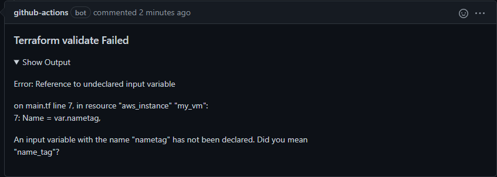

# Terraform Validate action

This is one of a suite of terraform related actions.

This action uses the `terraform validate` command to check that a terraform configuration is valid.
This can be used to check that a configuration is valid before creating a plan.

If the terraform configuration is not valid, the GitHub Action job failed.

A comment will be added to the pull request with the output of the `terraform validate` in case of error.
Can be removed by adding the input 'Comment' and set the value to false.

## Requirements

* This GitHub Actions does not install `terraform`, so you have to install them in advance.

```yaml
      - name: Setup Terraform
        uses: hashicorp/setup-terraform@v2
        with:
          terraform_wrapper: false
```

## Inputs

* `path`

  Path to the terraform configuration file.

  - Type: string
  - Optional
  - Default: The current directory

* `workspace`

  Terraform workspace to use for further operations. Note that for remote operations in Terraform Cloud/Enterprise, this is always `default`.

  - Type: string
  - Optional
  - Default: default

## Environment Variables

* `GITHUB_TOKEN`

  The GitHub authorization token to use to add a comment to a PR. 
  The token provided by GitHub Actions can be used - it can be passed by
  using the `${{ secrets.GITHUB_TOKEN }}` expression, e.g.

  ```yaml
  env:
    GITHUB_TOKEN: ${{ secrets.GITHUB_TOKEN }}
  ```

  The token provided by GitHub Actions will work with the default permissions.
  The minimum permissions are `pull-requests: write`.
  It will also likely need `contents: read` so the job can checkout the repo.

## Example usage

This example workflow runs on pull request and fails if terraform configuration is not valid.

```yaml
name: Validate terraform configuration

on:
  pull_request:

jobs:
  TerraformValidate:
    runs-on: ubuntu-latest
    name: Validate terraform configuration
    env:
      GITHUB_TOKEN: ${{ secrets.GITHUB_TOKEN }}
    steps:
      - name: Checkout
        uses: actions/checkout@v3.0.2

      - name: terraform init
        id: init
        run: terraform init

      - name: terraform validate
        id: validate
        uses: benyboy84/GitHubAction_terraform-validate@v1.0.0
        with:
          path: ./modules
          workspace: prod
```

## Screenshots


